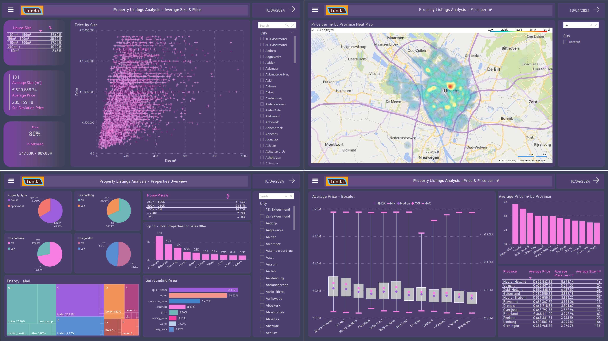

# Funda Properties Listings Data Analysis 🏡



This project consisted of **collecting**, **processing** and **analyzing** data of the Dutch real estate market, based on property listings available on [Funda](https://www.funda.nl/) website. The ETL pipeline carried out within it made use of Apache Airflow for orchestrating the Python scripts that run its main tasks and the Power BI application for the data analysis.
However, it's possible to run the Python scripts directly as well, if you don't want to use Apache Airflow. Just skip the 3rd, 4th, and 5th steps.

- Project Workflow
    - Automated Extraction and Cleaning Pipeline using Apache Airflow (DAG) running 3 tasks:
        1. **E**xtract: webscraping_task running the webscraping_script.py - that collect data via Web Scraping using the [Funda Scraper](https://github.com/whchien/funda-scraper) module
        2. **T**ransform: processing_task running the data_processing_script.py - that does cleaning/pre-processing, executed in bite-size chunks, using
            - Numpy/Pandas for cleaning
            - Beautiful Soup for dataset enrichment, scraping some additional data directly from Funda
            - Geopy for obtaining geolocations
        3. Concatenate: concat_task running the concatenation_script.py - that concatenate chunks and province files in a single file dataset
  Tasks Dependencies: webscraping_task >> processing_task >> concat_task
    - PowerBI part:
        - **L**oad: (+ additional transformation): Made on Power BI for Exploratory Data Analysis and for generating visualizations

In this repository, you find the Python scripts along with the Power BI project. For more details, see the [full documentation](https://nathmota.github.io/funda-analysis/).

## This Repository Structure

- `data/`: Used to store raw, processed and external data
- `src/`: Python scripts used for web scraping, data cleaning/pre-processing and Airflow settings.
- `docs/`: Github page containing the complete project documentation, results, reports and figures.
- `README.md`: This file.
- `requirements.txt`: Project dependencies list.

## Run the Project

To run the Python scripts, you'll need Python 3, the dependencies listed on the `requirements.txt`, and Apache Airflow. 
For loading the Power BI project (`.pbix` file), you'll need the Power BI Desktop application. The process, from start to end can be executed as follows:
 
1. Clone this repository:
    ```bash
    # Go to your project diretory
    cd project_local_path/projects
    # Clone this repository
    $ git clone https://github.com/nathmota/funda-analysis.git
    # Go into the repository
    $ cd funda-analysis
    ```
2. Install the dependencies using pip (directly or from within you preferred virtual environment):
    ```bash
    pip install -r requirements.txt
    ```

3. Install Apache Airflow by running the instructions bellow via bash script or setting manually the CONSTRAINT_URL:
   ```
   export AIRFLOW_HOME=~/airflow
    
    AIRFLOW_VERSION=2.9.2
    
    CONSTRAINT_URL="https://raw.githubusercontent.com/apache/airflow/constraints-${AIRFLOW_VERSION}/constraints-${PYTHON_VERSION}.txt"
    # For example this would install 2.9.2 with python 3.8: https://raw.githubusercontent.com/apache/airflow/constraints-2.9.2/constraints-3.8.txt
    
    pip install "apache-airflow==${AIRFLOW_VERSION}" --constraint "${CONSTRAINT_URL}"
    
    # Init the airflow DB
    airflow db init
    ```
   You can also check the [official page instructions](https://airflow.apache.org/docs/apache-airflow/stable/start.html).

   In your project folder, there is a folder called dags. Inside it, the DAG file corresponds to the DAG workflow, where the tasks and the dependencies between them are defined.

4. Start the Airflow web server and scheduler services:

   ```bash
       airflow webserver -D
       airflow scheduler -D
    ```
   The application runs on port 8080. To access Airflow's interface, open your web browser and navigate to http://127.0.0.1:8080/dags.

5. In the Airflow DAG's page, click on the 'funda_tasks_dag'. At the upper right hand corner there is a play button, click on it and then, 'Trigger DAG'. Once the three tasks have a dark green circle, the tasks are successfully finished. Otherwise, red circles indicates failure, and if you click on the task and then the 'Logs' tab, you can check error messages.
    
6. **(optional)** Edit the parameters used for web scraping as you need (on the `src/webscraping_script.py` file). The default parameters used for this project were following:
   ```bash
    raw_folder_path = "project_path/funda-analysis/data/raw/"
    provincies = ["provincie-drenthe", "provincie-groningen", "provincie-flevoland", "provincie-friesland", "provincie-zeeland", "provincie-limburg", "provincie-utrecht", "provincie-overijssel","provincie-gelderland","provincie-noord-brabant","provincie-noord-holland","provincie-zuid-holland"]
    want_to = "buy"
    find_past = False
    n_pages = 50        # records every 50 pages (750 entries) to avoid loss in case of execution failure
    final_page = 2000
    entries_per_page = 15
    raw_data = True
    ```
   As those parameters are directly infeed into the Funda Scraper module on its usage, you can consult [its documentation](https://github.com/whchien/funda-scraper) and/or [Funda](https://www.funda.nl/) website to better understand how to adapt it to your use case.
   
7. Run the web scraping script to collect data:
    ```bash
    python src/webscraping_script.py
    ```
8. **(optional)** Edit the data processing script (`src/data_processing_script.py`) to set on it different parameters for the processing step, including file paths (from where files are read and written to);
 
9. Run the data processing script:
    ```bash
    python src/data_processing_script.py
    ```
10. **(optional)** Edit the chunks concatenator script (`src/chunks_concat.py`), setting different parameters, including some file paths (again to define from where files are read and written to).

11. Run the chunks concatenator script:
    ```bash
    python src/chunks_concat.py
    ```
12. Open the Power BI project (`docs/reports/funda_report.pbix`) on the Power BI Desktop application, loading the processed data for analysis and visualization. If no personalization was made to change that, you'll find the processed data to be loaded on the Power BI Desktop application stored on its default location, at `data/preprocessed/processed_data.csv`.

## Results
For checking an offline snapshot of the visualizations and the results I've produced in my analyzis, see the [full documentation](https://nathmota.github.io/funda-analysis/).
