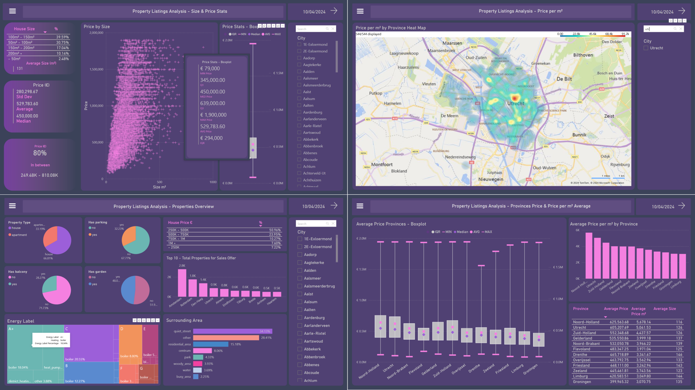

# Funda Properties Listings Data Analysis 🏡



This project consisted of **collecting**, **processing** and **analyzing** data of the Dutch real estate market, based on properties listings available on [Funda](https://www.funda.nl/) website. The ETL process carried out within it made use of Python scripts and the Power BI application as follows:
- Python scripts part:
    - **E**xtract: via Web Scraping using the [Funda Scraper](https://github.com/whchien/funda-scraper) module
    - **T**ransform (cleaning/pre-processing): executed in bite-size chunks, using:
        - Numpy/Pandas for cleaning
        - Beautiful Soup for dataset enrichment, scraping some additional data directly from Funda
        - Geopy for obtaining geolocations
- PowerBI part:
    - **L**oad: (+ additional transformation): Made on Power BI for Exploratory Data Analysis and for generating visualizations

In this repository, you find the Python scripts along with the Power BI project. For more details, see the [full documentation](https://nathmota.github.io/funda-analysis/).

## This Repository Structure

- `data/`: Used to store raw, processed and external data
- `src/`: Python scripts used fo web scraping and data cleaning/pre-processing.
- `docs/`: Github page containing the complete project documentation, results, reports and figures.
- `README.md`: This file.
- `requirements.txt`: Project dependencies list.

## Run the Project

To run the Python scripts, you'll need Python 3 and the dependencies listed on the `requirements.txt`. For loading the Power BI project (`.pbix` file), you'll need the Power BI Desktop application. The process, from start to end to run it can be executed as follows:

1. Clone this repository:
    ```bash
    # Go to your project diretory
    cd project_local_path/projects
    # Clone this repository
    $ git clone https://github.com/nathmota/funda-analysis.git
    # Go into the repository
    $ cd funda-analysis
    ```
2. Install the dependencies using pip (directly or from within you preferred virtual environment):
    ```bash
    pip install -r requirements.txt
    ```
3. **(optional)** Edit the parameters used for web scraping as you need (on the `src/webscraping_script.py` file). The default parameters used for this project were following:
   ```bash
    raw_folder_path = "project_path/funda-analysis/data/raw/"
    provincies = ["provincie-drenthe", "provincie-groningen", "provincie-flevoland", "provincie-friesland", "provincie-zeeland", "provincie-limburg", "provincie-utrecht", "provincie-overijssel","provincie-gelderland","provincie-noord-brabant","provincie-noord-holland","provincie-zuid-holland"]
    want_to = "buy"
    find_past = False
    n_pages = 50        # records every 50 pages (750 entries) to avoid loss in case of execution failure
    final_page = 2000
    entries_per_page = 15
    raw_data = True
    ```
   As those parameters are directly infeed into the Funda Scraper module on its usage, you can consult [its documentation](https://github.com/whchien/funda-scraper) and/or [Funda](https://www.funda.nl/) website to better understand how to adapt it to your use case.
   
4. Run the web scraping script to collect data:
    ```bash
    python src/webscraping_script.py
    ```
5. **(optional)** Edit the data processing script (`src/data_processing_script.py`) to set on it different parameters for the processing step, including file paths (from where files are read and written to);
 
6. Run the data processing script:
    ```bash
    python src/data_processing_script.py
    ```
7. **(optional)** Edit the chunks concatenator script (`src/chunks_concat.py`), setting different parameters, including some file paths (again to define from where files are read and written to).

8. Run the chunks concatenator script:
    ```bash
    python src/chunks_concat.py
    ```
9. Open the Power BI project (`docs/reports/funda_report.pbix`) on the Power BI Desktop application, loading the processed data for analysis and visualization. If no personalization was made to change that, you'll find the processed data to be loaded on the Power BI Desktop application stored on its default location, at `data/preprocessed/processed_data.csv`.

## Results
For checking an offline snapshot of the visualizations and the results I've produced in my analyzis, see the [full documentation](https://nathmota.github.io/funda-analysis/).
