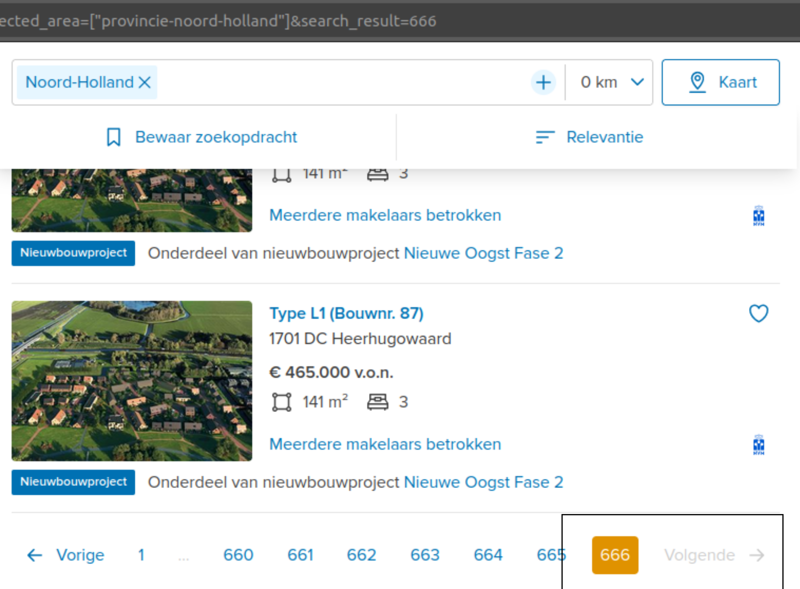
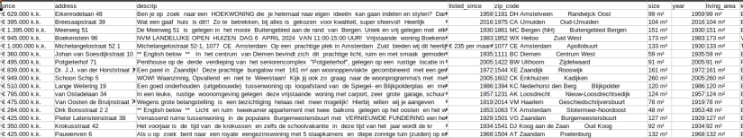

# Funda Properties Listings Data Analysis 

Nathalia V. M. de Oliveira - April, 2024.

### Analysis of the Dutch Housing Market, based on Properties Listings Available on *funda.nl* website.

## Project Objective:
1. Provide an overview of the housing market in the Netherlands through online property listings;
2. Generate insights into the most valuable or cost-effective locations among provinces and cities;
3. Examine the profile of houses and the distribution of their most common features;
4. Identify factors that may contribute to the variation in property prices.

## Data Source

[Funda](https://www.funda.nl/) is a Dutch platform established over 20 years ago. According to their website, Funda is the largest platform connecting supply and demand in the real estate market of the Netherlands, with over 4 million unique visitors per month and hosting around 97% of the Dutch housing market.

According Funda's Terms and Conditions, scraping its website is only allowed for personal use.


## Collecting the Data

[Webscraping script:](../src/webscraping_script.py)

The data were scraped from Funda using [FundaScraper](https://github.com/whchien/funda-scraper) for Python.
There are several different sets of arguments that can generate diverse searches. For this project, the following arguments have been used:
```
area=provincie
want_to=buy
find_past=False
page_start=1
n_pages = 50
raw_data=True
```

- **area=provincie**:
To fetch data by province. You can also search for city, neighborhood, or postcode.
- **want_to=buy**:
Regarding properties for sale. You can switch to "rent".
- **find_past=False**:
Regarding properties available at the moment, not already sold
- **n_pages = 50**:
Number of pages to be fetched. A certain number of pages I found is safe to record partially, to avoid loss in case of execution failure.
- **raw_data=True**:
To fetch the data without any preprocessing. I decided to do all the preprocessing myself. However, it's possible to set the argument to False to receive beautifully processed and structured data.

Although searching by province may return 12,000 results, for instance, Funda only makes a maximum of 666 pages accessible, as shown below. This equates to 9,990 entries, as each page contains 15 listings.

Then, every 50 pages (or 750 entries), the script scrapes and records the data into a CSV regarding each province.


[See the provinces results.](https://www.funda.nl/koop/bladeren/). 





### Data Overview

The data were collected on the 10th and 11th of April, 2024, which means that the dataset for this case study includes all the housing property listings **available** for sale during **that period**.

The raw scraped dataset contains the following columns:

1. url
2. price
3. address
4. description
5. listed_since
6. zip_code
7. size
8. year_built
9. living_area
10. kind_of_house
11. building_type
12. num_of_rooms
13. num_of_bathrooms
14. layout
15. energy_label
16. insulation
17. heating
18. ownership
19. exteriors
20. parking
21. neighborhood_name
22. date_list
23. date_sold
24. term
25. price_sold
26. last_ask_price
27. last_ask_price_m2
28. city

And they look like this:



You can also check it up on [raw data](../data/raw/). It’s possible to see that it is going to take a lot of work.

And so, the following provinces CSV files were generated. The number corresponds to the quantity of listings returned:

Drenthe - 1912 
Groningen - 1946
Flevoland - 2161
Friesland - 2280
Zeeland - 3033
Limburg - 4095
Utrecht - 4146
Overijssel - 4305
Gelderland - 7410
Zuid Holland - 9990
Noord Brabant - 10004
Noord Holland - 10004


For some reason, Noord Holland and Noord Brabant have more than 9990 listings. I assumed they could be duplicates and would be treated accordingly during the processing step.

The raw dataset then starts with 61,286 entries and 1.1 GB in size.


## Processing the Data

[Data processing script](../src/data_processing_script.py) using Pandas for Python.

### Using chunks
The script loads raw data from CSV files corresponding to different provinces of the Netherlands from specified folders. As the cleaning process progressed and became more complex and heavy, there was a need to adopt a measure to maintain the already processed data and avoid losses due to frequent interruptions in execution caused by unexpected occurrences. The cleaning and writing process for each province was then partitioned into chunks of 300 instances and executed in a loop.
 

### General cleaning: 

It removes rows with **missing values** in essential columns, **eliminates duplicate** records and addresses, and **drops columns** that won't be used later.

### Cleaning specific features:

- **Size (size_m2)**: Removes unwanted characters, converts to numeric type, and renames the column.
- **Price (price)**: Removes unwanted characters and converts to numeric type.
- **Price per square meter (price_m2)**: Calculates the price per square meter.
- **Year built (year_built)**: Extracts only the last 4 digits of the year and converts to numeric type.
- **House age (house_age)**: Calculates the age of the house relative to the current year.
- **Energy label (energy_label)**: Extracts the relevant part of the energy label.
- **Heating (heating)**: Extracts patterns from text and categorizes the heating type.
- **Parking (has_parking)**: Determines if the property has parking based on the description.
- **Exteriors (has_balcony, has_garden, surrounding)**: Identifies if the property has a balcony and garden, and categorizes the surrounding environment by extracting patterns.
- **House type (house_type), House ID (house_id), Listing date (date_list), Province (provincie)**: Extracts from the URLs.
- **Layout (num_of_floors, located_floor, num_of_rooms, num_of_bedrooms, num_of_bathrooms, num_of_toilets)**: Extracts information about the property layout text content and cleans associated values. 
- **Addresses and Zip codes**: Cleans addresses, extracts complete zip codes, and obtains geolocation (geographical coordinates) by using **Geopy**.

### Concatenating
Finally, another script concatenates the chunks of each province into a file per province and then concatenates all the province files into a single CSV file.

## Moving to Power BI
sdf

## Table of Contents

- [Results](results.md)
- [Figures](figures.md)
- [Reports](reports.md)

## Results

To see detailed results and insights, visit [Results](results.md).

## Figures

To view the generated figures and graphs, visit [Figures](figures.md).

## Reports

To read the complete reports, visit [Reports](reports.md).
