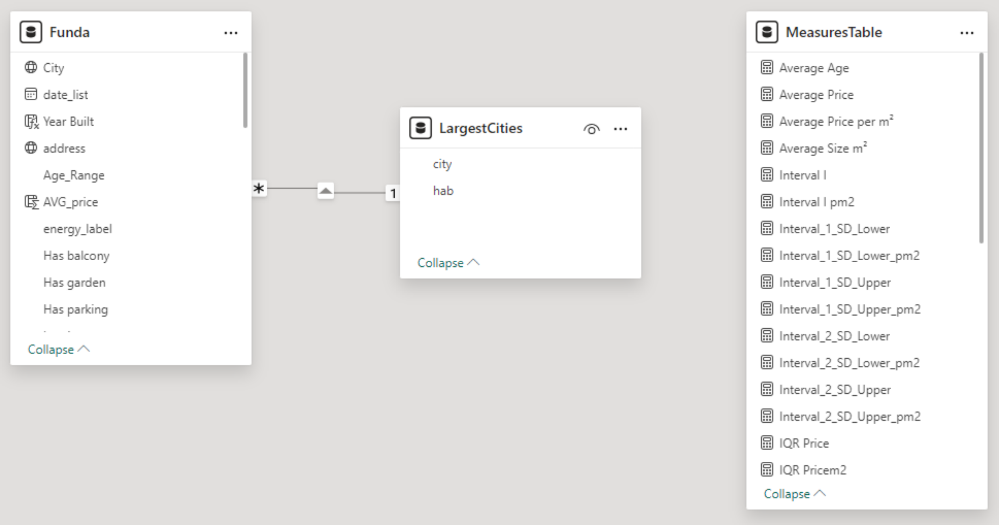
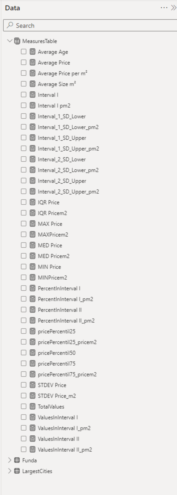
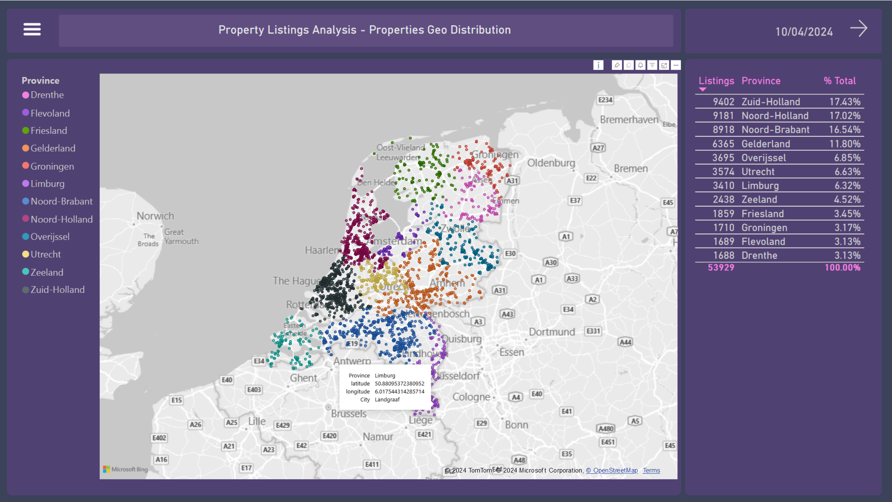
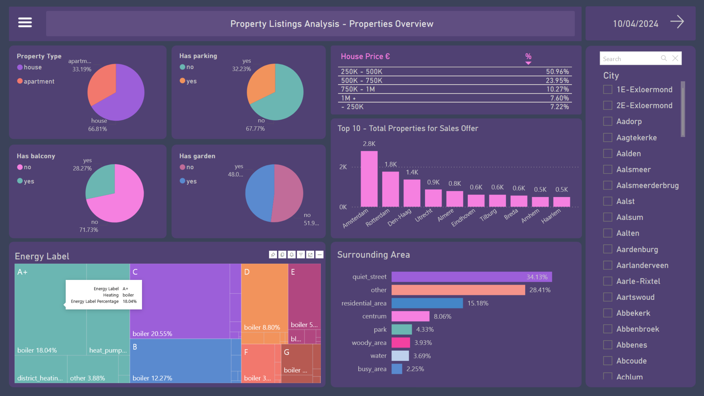
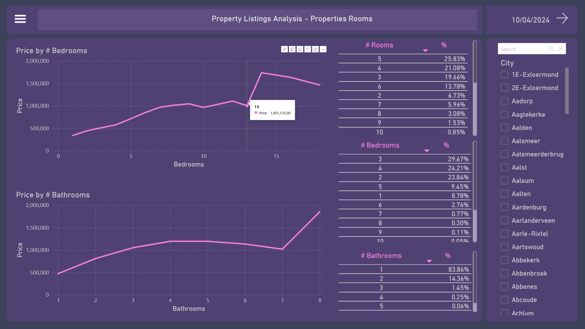
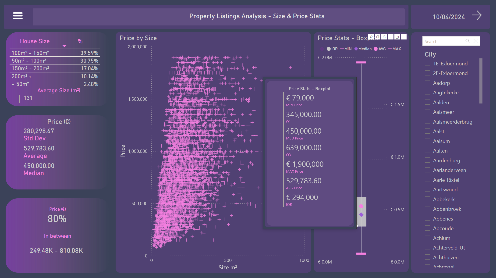
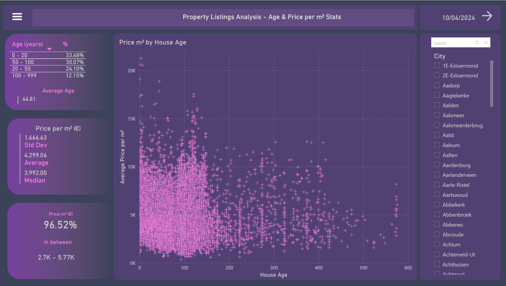
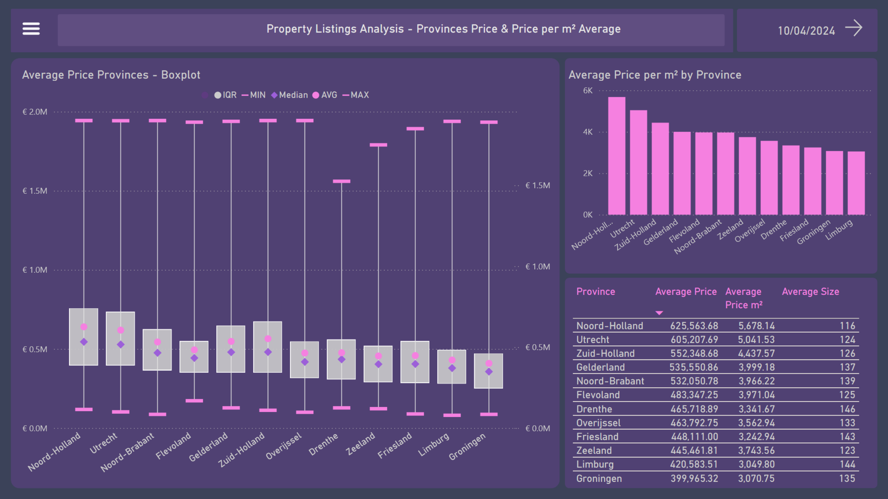
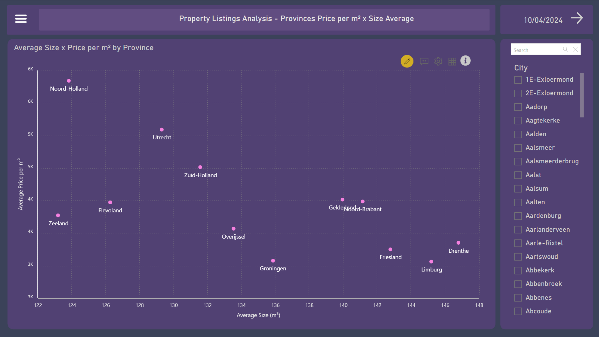
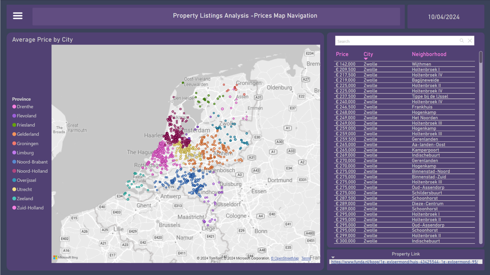

# Funda Properties Listings Data Analysis 

Nathalia V. M. de Oliveira - April, 2024.

### Analysis of the Dutch Housing Market, based on Properties Listings Available on *Funda.nl* website.

## Project Objective:
1. Provide an overview of the housing market in the Netherlands through online property listed on the Funda.nl website;
2. Generate insights into the most valuable or cost-effective locations among provinces and cities;
3. Examine the profile of houses and the distribution of their most common features;
4. Identify factors that may contribute to the variation in property prices.

## Data Source

[Funda](https://www.funda.nl/) is a Dutch residential platform established since more than 20 years ago. According to their website, Funda is the largest platform connecting supply and demand in the real estate market of the Netherlands, with over 4 million unique visitors per month and hosting around 97% of the Dutch housing market.

According Funda's Terms and Conditions, scraping its website is only allowed for personal use.


## Collecting the Data

[Webscraping script](https://github.com/nathmota/funda-analysis/blob/main/src/webscraping_script.py)

The data were scraped from Funda using [FundaScraper](https://github.com/whchien/funda-scraper) for Python.
There are several different sets of arguments that can generate diverse searches. For this project, the following arguments have been used:
```
area=provincie
want_to=buy
find_past=False
page_start=1
n_pages = 50
raw_data=True
```

- **area=provincie**:
To fetch data by province. You can also search for city, neighborhood, or postcode.
- **want_to=buy**:
Regarding properties for sale. You can switch to "rent".
- **find_past=False**:
Regarding properties available at the moment, not already sold
- **n_pages = 50**:
Number of pages to be fetched. A certain number of pages I found is safe to record partially, to avoid loss in case of execution failure.
- **raw_data=True**:
To fetch the data without any preprocessing. I decided to do all the preprocessing myself. However, it's possible to set the argument to False to receive beautifully processed and structured data.

Although searching by province may return, for instance, 12,000 results, Funda only makes a maximum of 666 pages accessible, as shown below. This equates to 9,990 entries, as each page contains 15 listings.

You can have a preview of this search by province results [here](https://www.funda.nl/koop/bladeren/).

Then, every 50 pages (or 750 entries), the script scrapes and records the data into a CSV regarding each province.


### Data Overview

The data were collected on the 10th of April, 2024, which means that the dataset for this case study includes all the housing property listings **available** for sale during **that period**.

The raw scraped dataset contains the following columns:

1. url
2. price
3. address
4. description
5. listed_since
6. zip_code
7. size
8. year_built
9. living_area
10. kind_of_house
11. building_type
12. num_of_rooms
13. num_of_bathrooms
14. layout
15. energy_label
16. insulation
17. heating
18. ownership
19. exteriors
20. parking
21. neighborhood_name
22. date_list
23. date_sold
24. term
25. price_sold
26. last_ask_price
27. last_ask_price_m2
28. city

And they look like this:


You can also check it up on [raw data](../data/raw/). It’s possible to see that it is going to take a lot of work.

And so, the following provinces CSV files were generated. The number corresponds to the quantity of listings returned:
```
Drenthe - 1912 
Groningen - 1946
Flevoland - 2161
Friesland - 2280
Zeeland - 3033
Limburg - 4095
Utrecht - 4146
Overijssel - 4305
Gelderland - 7410
Zuid Holland - 9990
Noord Brabant - 10004
Noord Holland - 10004
```

For some reason, Noord Holland and Noord Brabant have more than 9990 listings. I assumed they could be duplicates and would be treated accordingly during the processing step.

The raw dataset then starts with 61,286 entries and 1.1 GB in size.


## Processing the Data

[Data processing script](../src/data_processing_script.py) using Pandas for Python.

### Using chunks
The script loads raw data from CSV files corresponding to different provinces of the Netherlands from specified folders. As the cleaning process progressed and became more complex and heavy, there was a need to adopt a measure to maintain the already processed data and avoid losses due to frequent interruptions in execution caused by unexpected occurrences. The cleaning and writing process for each province was then partitioned into chunks of 300 instances and executed in a loop.
 

### General cleaning: 

- It removes rows with **missing values** in essential columns, those whose absence would make most analyses impossible. Other blank data were accepted and left blank, as they are assumed to be Missing Completely at Random (MCAR). 
- **Eliminates duplicate** identical records and also identical addresses.
- **Drops columns** that won't be used later.

### Cleaning specific features:

- **Size (size_m2)**: Removes unwanted characters, converts to numeric type, and renames the column.
- **Price (price)**: Removes unwanted characters and converts to numeric type.
- **Price per square meter (price_m2)**: Calculates the price per square meter (m²).
- **Year built (year_built)**: Extracts only the last 4 digits of the year and converts to numeric type.
- **House age (house_age)**: Calculates the age of the house relative to the current year.
- **Energy label (energy_label)**: Extracts the relevant part of the energy label.
- **Heating (heating)**: Extracts patterns from text and categorizes the heating type.
- **Parking (has_parking)**: Determines if the property has parking based on the description.
- **Exteriors (has_balcony, has_garden, surrounding)**: Identifies if the property has a balcony and garden, and categorizes the surrounding environment by extracting patterns.
- **House type (house_type), House ID (house_id), Listing date (date_list), Province (provincie)**: Extracts from the URLs.
- **Layout (num_of_floors, located_floor, num_of_rooms, num_of_bedrooms, num_of_bathrooms, num_of_toilets)**: Extracts information about the property layout text content and cleans associated values. 
- **Addresses and Zip codes**: Cleans addresses, extracts complete zip codes, and obtains geolocation (geographical coordinates) by using **Geopy**.

- For outlier detection, the Z-score method was applied on the property prices. Results greater than 3 were considered outliers, which in the dataset reflect prices up to €1,900,000.
- Then, **782** were considered outliers, while **53,117** were considered normal.

### Concatenating chunks and files
Finally, another script concatenates the chunks of each province into a file per province and then, concatenates all the province files into a single CSV file.
The final processed file contains 53,931 entries and 18,7 MB in size.

## Exploratory Data Analysis (EDA) and Visualization

The exploratory data analysis, as well as the visualizations, are built using ***Power BI***, in order to understand the data distribution, patterns, relationships and generate insights.

### Transformation

The processed data CSV file is loaded, and techniques such as ty
pe adjustment, column splitting and renaming, and creating columns with value ranges are applied in the Power Query editor.


### Modeling

At this stage, a new data source is also incorporated: a table with some of the largest and main cities in the Netherlands along with their respective populations, which will be used in future analyses. 
Thus, the "Funda" and "LargestCities" tables are related through the column "city".



### Measures

A few measures were defined using DAX (Data Analysis Expressions), in a separated table, to support the analyses:



## Visualizations and Results

### 1. Geo Distribution

On the first dashboard, it's possible to see how the properties are distributed within the country. The number and percentage of listings in each province show their contributions to the housing market supply of the country. 



They are **53,929 listings** over 2030 cities.

Zuid-Holland, Noord-Holland, and Noord-Brabant are the provinces with the **highest number of property listings** for sale, accounting for approximately 50% of the country's total supply.
The standard map visual from Power BI uses coordinates as the geolocation indicators.

### 2. Properties Overview



The second dashboard displays the occurrence of some features among the properties.

- The vast majority of houses (74.91%) cost between €250K and €750K
- Amsterdam, Rotterdam, Den Haag, Utrecht, and Almere are the cities with the highest supply of properties
- Approximately two-thirds of residential properties are houses, and one-third are apartments as shown in the pie chart
- Most of them (67.77%) do not have their own parking
- As for the presence of a garden, there is a balance, with 48.02% having a garden and 51.98% not having it
- As for balconies, only 28.27% of properties have it
- The treemap indicates the proportion of the energy labels among the properties as well as their respective types of heating
- The bar chart show us the main surroundings of the properties
- On this page, it is also possible to see the results by city using the filters

### 3. Properties Rooms


   
- The line charts indicates a trend of increasing property's prices in relation to the number of bedrooms and bathrooms
- The majority of houses (66.57%) have between 3, 4, and 5 **rooms**, 2 to 3 **bedrooms**, and 1 **bathroom**
- On this page, it is also possible to see the results by city using the filters

### 4. Size & Price Stats



- Regarding size, around 70% of properties measure between 50 and 150 m²
- The overall **average size** of houses in the country is **131 m²**
- The overall **average pric**e is **€529,783.60** 
- The median is €450,000
- With a standard deviation of €280,298.67, it can be concluded that 80% of properties fall within the range of €249K and €810K 
- Through the scatter plot, a clearer clustering can be observed in areas up to 250m² on the X-axis and up to €1M on the Y-axis
- A boxplot presents the descriptive
-  statistics of property prices in the country:
  ```
  Minimum value: €79,000
  Maximum value: €1,900,000
  Mean: €529,783.60
  Median: €450,000 
  Standard deviation: €280,298.67
  Interquartile range: €294,000
  1st quartile: €345,000
  3rd quartile: €639,000
  ```
  - On this page, it is also possible to see the results by city using the filters

### 5. Age & Size per m² Stats



- Regarding age, 57,78% of properties are **less than 50 years old**
- The overall **average age** of houses in the country is **44.81** years old
- The overall **average price per square meter** is **4,299.06** euros
- The median is 3,992.00 euros
- With a standard deviation of 1,666.63 euros, it can be concluded that 96.52% of properties fall within the range of 2.7K and 5.77K euros
- Through the scatter plot, a clearer clustering can be observed in areas up to 140 years old on the X-axis and up to 10K euros on the Y-axis
- On this page, it is also possible to see the results by city using the filters


### 6. Provinces Price & Price per m² Average

The same metrics from the previous boxplot presents now a comparison between the provinces:



- Boxplot provinces:
   -  Noord-Holland tops the list with highest average and median property prices, approaching €800K at the upper end of the IQR
   -  Utrecht and Zuid-Holland follow closely with relatively high average prices
   -  Groningen and Limburg show the lowest average, under €500K, indicating more affordable prices
   -  The range of property prices is broad in most provinces, indicating variability in property values

- Column chart:
With €5.67K and €5.04K, Noord-Holland and Utrecht have the highest average prices per square meter among the provinces, while Limburg and Groningen have an average of around €3K.

- The table below contains a summary of all the average prices, prices per m², and sizes of the provinces

### 7. Provinces Price per m² x Size Average



The scatter chart highlights the relationship between the average size of properties and the average price per square meter across different provinces.

- Noord-Holland and Utrecht are disputed markets with high prices per m² and smaller property sizes;

- Zuid-Holland offers a balance with moderate property prices and sizes;

- Zeeland, Groningen, Drenthe, and Limburg provide more affordable options with larger property sizes, making them **attractive for buyers seeking more space at lower costs**.;

- Provinces like Gelderland, Noord-Brabant, Friesland, and Overijssel provide a good balance of size and price, catering to a wide range of buyers.

### 8. Price per m² Heat Map

On the Heat Map, the price per m² values are depicted by color, which allows us to have a general sense of the intensity of the value throughout the country, provinces, cities, and neighborhoods.
Some Power BI maps have a point limit for rendering. In the case of the customized visual used in this representation (by Weiwei Cui), the limit is 30,000 points, which can be selected randomly or according to the data input (there is no clear documentation of it). This makes the visualizations more consistent when filtered by provinces or cities.


### 9. Major Cities by Population


Now the scatter chart represents, in three dimensions, the main cities of the Netherlands with their average prices per m², average sizes, and population densities. 

- Amsterdam, standing alone, represents the lowest value for money in terms of price per m² and space; while at the other extreme, also standing alone, is Venlo, with the second lowest average prices and the largest average space among the 32 cities.

- A dashed line in the background shows the increasing trend between the variables price per m² and size.


### 10. Prices Map Navigation

In the last dashboard, there is a bubble map with a size scaler relative to the property price. With a more open zoom, it is possible to see the country with province labels divided by colors, and also use them for filtering. Once filtered to a smaller granularity, such as by city, the bubbles will become more visible, and it is possible to identify the cheapest to most expensive properties.


Both through the zoom and the table next to it, it is also possible to navigate through the neighborhoods, select a property, and open the URL referring to it, which appears in the bottom left corner, as shown in the figure.




## Challenges and Limitations

Podem ser consideradas limitações deste projeto:

- Atualização dos dados
	Os processos de extração e processamento podem levar dias, o que dificulta manter o dashboard "up to date". Sendo assim, este projeto contempla, até aqui, um snap shot do dia em que foi feita a extração dos dados.
- Para progredir do status de estudo de caso e se tornar uma ferramenta funcional, também seria necessária uma licença para que o Microsoft Power BI permitisse a publicação do relatório, e para que todas as suas ferramentas de interatividade fossem usufruídas.
- O fato do Heat Map não carregar mais de 30,000 entradas limite a visibilidade de todos os pontos 


### Possiveis Extensões: O Funda Scraper permite a raspagem de dados passados, ou seja, um historico de anuncios com imoveis que tambem ja foram vendidos e não somente os que estao no mercado. Com estes dados seria possivel fazer uma analise temporal do mercado, extrair padroes e fazer previsões, o que seria uma extensão muito interessante para este projeto.


